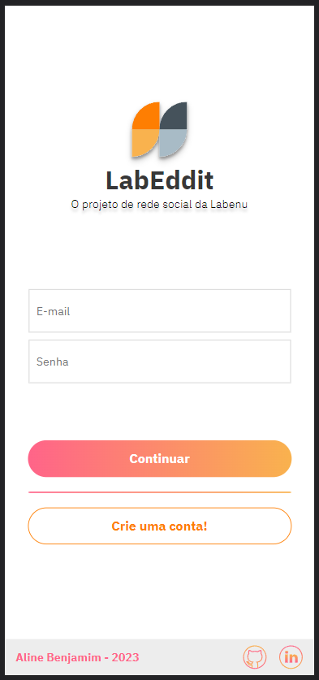
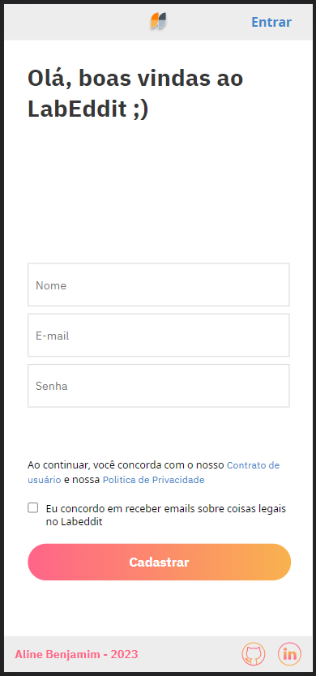
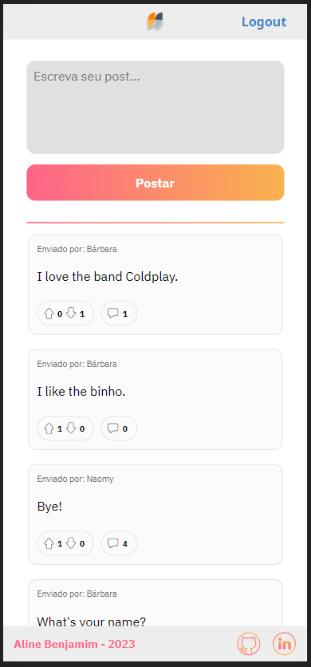
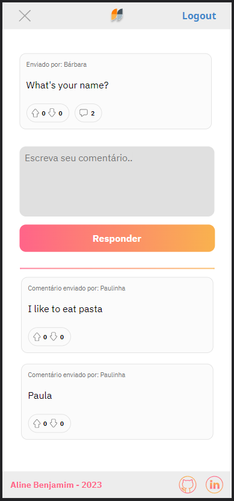

# Projeto-Labeddit-Front-End  

---

## 📑Introdução

    Esse é um projeto de uma rede social chamada Labeddit. 
    É uma rede social que tem como objetivo promover a conexão a interação entre pessoas. As pessoas que se cadastram no aplicativo podem criar posts e curtir publicações.
    O labeddit é um projeto Full Stack, sendo desenvolvido com Mobile First, com foco na arquitetura e desenvolvimento web e também o direcionamento aos dispositivos móveis.     
---

## 📸 Imagem do Labeddit

---

## ⚙️Tecnologias utilizadas

1. ``React.js``
2. ``React Router``
3. ``Axios``
4. ``Styled Components``
5. ``Vite.js``
7. ``Consumo de API REST`` 

---

## 📱Funcionabilidades do Projeto

- Login
- Signup
- Create posts
- Create comments
- Like ou dislike posts
- Like ou dislike comments
 

---

## ✒️Aplicações utilizadas

- Postman
- Render
---

## 📋Documentação

- ``Postman`` <https://documenter.getpostman.com/view/24461105/2s93RL2wkA>

---

## 💻 Repositório Back-End

- GitHub <https://github.com/AlineBCBenjamim/Labeddit-back-end>

--- 

## 🧠 Deploy

- Vercel <https://labeddit-front-end-nine.vercel.app/login>

---
## 📀Rodando o Projeto

- Rode o console na pasta em que você baixou os arquivos;

- Insira o comando ``npm install``;

- Depois, o comando ``npm run dev`` para rodar no navegador.
